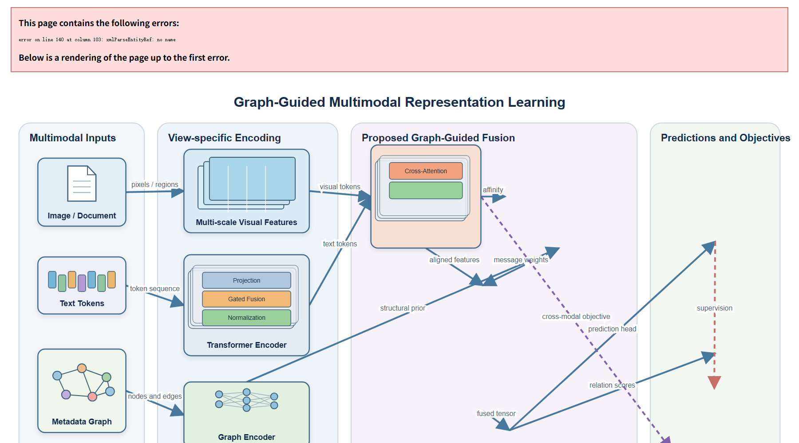
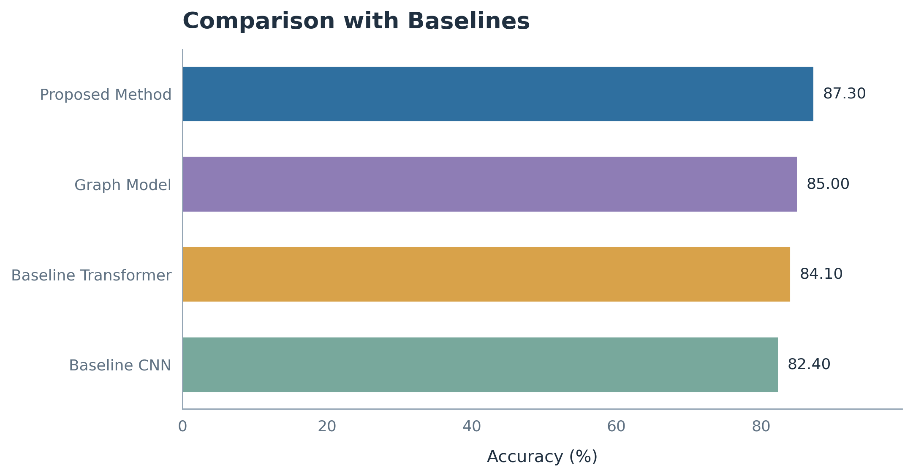
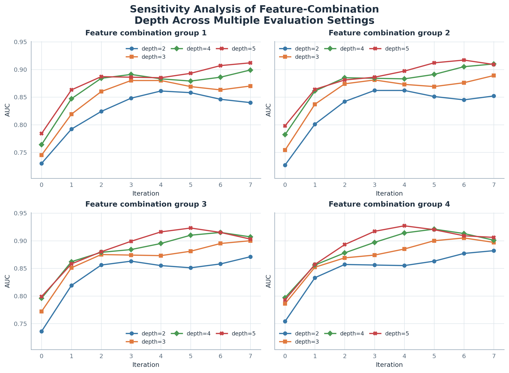

# CS Research Figure Skill

面向计算机科学与人工智能论文的可编辑科研绘图 Skill。它可以从不完整的方法描述、参考图和实验数据中，规划并生成方法框架图、模块图、对比实验图与消融实验图。

当前版本：`v0.1.0`

## 主要能力

- 从算法描述、公式、伪代码或代码中提取可视化结构。
- 支持 Transformer、Attention、RAG、Agent、MoE、LoRA/Adapter、多模态模型和知识图谱。
- 在方法图中使用张量层叠、Token 条带、网络层堆叠、图节点、模型图标、损失分支和局部放大。
- 生成可编辑 SVG；实验图同时导出 SVG、PDF、PNG 和数据源。
- 长标题自动按语义分成最多两行，SVG 文字保持可编辑。
- 对有序消融变量生成多折线图；对离散 remove-one 消融保留柱状图或点图。
- 检查文字越界、节点重叠、悬空连线、斜排文字和过窄配色。

## 测试生成效果

### 方法框架图



对应的 [结构规格](examples/method-figure/rich-example-spec.json) 可编辑，并可通过下方命令重新生成 SVG。方法图预览由同一规格生成。

### 对比实验图



对应的 [SVG](examples/comparison/demo-comparison.svg)、[PDF](examples/comparison/demo-comparison.pdf) 和 [CSV](examples/comparison/demo-comparison.csv) 可复现。

### 折线消融实验



对应的 [SVG](examples/ablation/demo-ablation-curves.svg)、[PDF](examples/ablation/demo-ablation-curves.pdf) 和 [CSV](examples/ablation/demo-ablation-curves.csv) 可复现。示例数据仅用于展示，不代表真实实验结论。

## 安装

克隆仓库并安装依赖：

```bash
git clone <your-repository-url>
cd cs-research-figure-skill
python -m pip install -r requirements.txt
```

将 Skill 目录复制到 Codex Skill 目录。

Windows PowerShell：

```powershell
Copy-Item -Recurse -Force .\skill\draw-cs-research-figures "$env:USERPROFILE\.codex\skills\"
```

macOS/Linux：

```bash
cp -R skill/draw-cs-research-figures ~/.codex/skills/
```

安装后可使用：

```text
Use $draw-cs-research-figures to turn my method description and experiment tables into editable research figures.
```

## 快速使用

生成方法图：

```bash
python skill/draw-cs-research-figures/scripts/validate_figure_spec.py examples/method-figure/rich-example-spec.json
python skill/draw-cs-research-figures/scripts/render_svg.py examples/method-figure/rich-example-spec.json output/method.svg
```

生成对比实验图：

```bash
python skill/draw-cs-research-figures/scripts/plot_experiments.py --input examples/comparison/demo-comparison.csv --kind comparison --title "Comparison with Baselines" --out-prefix output/comparison
```

生成折线消融图：

```bash
python skill/draw-cs-research-figures/scripts/plot_experiments.py --input examples/ablation/demo-ablation-curves.csv --kind ablation --ablation-mode auto --title "Sensitivity Analysis of Feature-Combination Depth Across Multiple Evaluation Settings" --out-prefix output/ablation
```

## 数据格式

对比实验：

```csv
variant,metric,value
Baseline A,Accuracy (%),84.10
Proposed Method,Accuracy (%),87.30
```

有序折线消融：

```csv
panel,x,series,value,metric,x_label,panel_title
group_1,0,depth=2,0.730,AUC,Iteration,Feature combination group 1
```

离散删模块消融：

```csv
variant,metric,value
Full model,Accuracy (%),87.30
w/o graph reasoning,Accuracy (%),84.80
```

## 仓库结构

```text
skill/draw-cs-research-figures/  Codex Skill 本体
examples/                        README 展示与可复现实例
tests/                           自动化测试
scripts/                         发布打包工具
.github/workflows/               GitHub Actions
```

## 测试与打包

```bash
python -m unittest discover -s tests -v
python scripts/package_skill.py
```

测试会重新生成方法图、对比图和折线消融图，并验证 SVG 文字、配色和结构。

## 当前限制

- 原生 PowerPoint 形状生成仍在开发中；当前以可编辑 SVG 为主。
- 复杂三维张量和定制插画仍需要针对论文内容精修。
- Skill 不会编造模块、指标或实验结果；缺失的科学信息会保留为待确认项。

## 许可证与素材

代码使用 MIT License。仓库不包含论文原图；参考论文只用于提炼通用结构与视觉语法。提交自己的数据或图像前，请确认相应授权。
