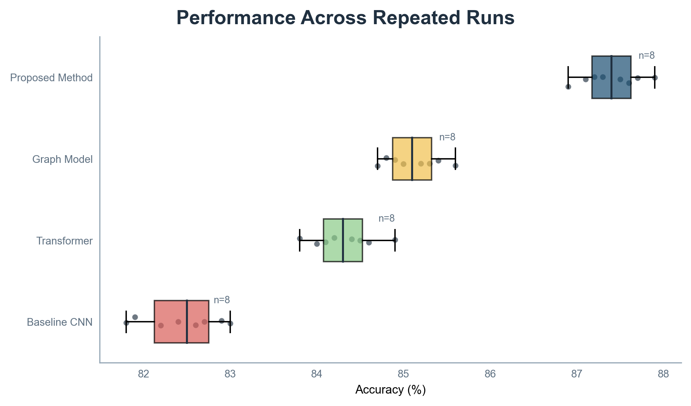

# CS Research Figure Skill

[中文](README.md) | [English](README_EN.md) | 当前版本：`v0.3.1`

面向计算机科学与人工智能论文的可编辑科研绘图 Skill。它可以从方法描述、参考图和实验 CSV 中生成方法框架图、模块说明图、对比实验图和消融实验图，并自动完成数据分析、图型选择、投稿预设和质量检查。

## 核心能力

- 支持 Transformer、Attention、RAG、Agent、MoE、LoRA/Adapter、多模态模型和知识图谱。
- 在方法图中使用张量层叠、Token 条带、网络层堆叠、图节点、模型图标、损失分支和局部放大。
- 自动识别样本量、误差列、变量类型和 IQR 异常值。
- 自动选择对比图、离散消融图、有序折线图、热力图或箱线图。
- 提供 CVPR、NeurIPS、ICML、ACL、IEEE 和中文论文预设。
- 输出可编辑 SVG、PDF、PNG、源数据、场景 JSON 和机器审计报告。
- 检查文字裁切、标签重叠、中文乱码、灰度可辨识性、DPI 和 PDF 字体嵌入。

## 生成效果

### 1. AI 方法框架图


包含多模态输入、张量层叠、Transformer 编码、图节点、融合模块、预测头和损失分支。对应文件：[SVG](examples/method-figure/rich-example.svg) · [场景 JSON](examples/method-figure/rich-example-spec.json)

### 2. 基线对比实验图


长方法名称保持水平，通过横向布局、直接数值标注和稳定方法配色提高可读性。对应文件：[SVG](examples/comparison/demo-comparison.svg) · [PDF](examples/comparison/demo-comparison.pdf) · [CSV](examples/comparison/demo-comparison.csv)

### 3. 有序消融与敏感性分析


适用于层数、LoRA rank、专家数、阈值、epoch 和迭代次数等有序变量；离散 `w/o module` 配置不会被错误连接。对应文件：[SVG](examples/ablation/demo-ablation-curves.svg) · [PDF](examples/ablation/demo-ablation-curves.pdf) · [CSV](examples/ablation/demo-ablation-curves.csv)

### 4. 自动分析、选图和检查



输入包含 4 种方法、每组 8 次重复实验。Skill 自动识别重复样本，选择“箱线图 + 原始点”，应用 CVPR 双栏预设，并完成三种格式的质量审计。对应文件：[SVG](examples/auto-selection/auto-boxplot.svg) · [PDF](examples/auto-selection/auto-boxplot.pdf) · [CSV](examples/auto-selection/repeated-runs.csv) · [数据分析](examples/auto-selection/profile.json) · [审计报告](examples/auto-selection/auto-boxplot-audit.json)

## 安装

### 在 Codex 中安装

在 Codex 对话中发送：

```text
请使用 skill-installer 安装：
https://github.com/qingfeng-qingshi/cs-research-figure-skill/tree/main/skill/draw-cs-research-figures
```

安装成功后，在新一轮任务中调用 `$draw-cs-research-figures`。

### 手动安装

```bash
git clone https://github.com/qingfeng-qingshi/cs-research-figure-skill.git
cd cs-research-figure-skill
python -m pip install -r requirements.txt
```

Windows PowerShell：

```powershell
Copy-Item -Recurse -Force ./skill/draw-cs-research-figures "$env:USERPROFILE/.codex/skills/"
```

macOS/Linux：

```bash
cp -R skill/draw-cs-research-figures ~/.codex/skills/
```

## 使用

这个仓库不是独立 GUI 软件。安装后，在 Codex 对话中调用 Skill，并提供以下一种或多种输入：

- 方法章节、算法描述、公式、伪代码或代码。
- 实验 CSV，包括模型、指标、数值、重复实验或误差信息。
- 仅用于提炼布局和视觉语言的参考图。
- 目标会议、期刊、栏宽、语言和输出格式。

### 用法一：根据方法描述生成框架图

```text
使用 $draw-cs-research-figures，读取 method.md。
先提取确定信息、待确认信息和图中核心论点，再生成方法总图与创新模块局部放大图。
图中需要包含张量流、Transformer 层、图推理模块、融合模块和损失分支；不要编造文中未说明的模块或维度。
采用 CVPR 双栏风格，输出可编辑 SVG、场景 JSON 和 PNG 预览，并执行自动质量检查。
```

预期输出：

```text
method.svg                 可编辑主文件
method-spec.json           节点、边、分组和样式
method-preview.png         README/PPT 预览
method-audit.json          自动检查结果
```

### 用法二：让 Skill 自动分析实验数据并选图

```text
使用 $draw-cs-research-figures，读取 results.csv。
先分析变量类型、每组样本量、误差列和异常值，再说明推荐图型及理由。
采用 NeurIPS 双栏预设，输出 SVG、PDF、PNG、数据分析 JSON 和自动检查报告。
普通文字保持水平，长标题最多分两行。
```

自动选择规则：

| 数据结构 | 自动选择 |
|---|---|
| `variant, metric, value` | 基线对比图 |
| `full / w/o module` | 离散消融图，不连线 |
| `x, series, value` | 有序折线图 |
| 方法 × 指标的稠密矩阵 | 热力图 |
| 每个方法有多次 seed/run | 箱线图 + 原始点 |

### 用法三：生成整套论文章节配图

```text
使用 $draw-cs-research-figures，读取 method.md、comparison.csv 和 ablation.csv。
统一规划方法框架图、基线对比图和消融实验图；保持模块名称、颜色语义、字体和指标格式一致。
方法图输出 SVG 与结构 JSON，实验图输出 SVG/PDF/PNG 与绘图代码。
使用 ACL 双栏预设，并为每张图生成 audit.json。
```

### 用法四：根据参考图重绘自己的内容

```text
使用 $draw-cs-research-figures，参考 reference.png 的信息密度、分区方式和视觉层级，
使用我在 method.md 中的真实算法内容重新绘制，不复制参考图中的论文专有文字、数据或图标。
保留张量层叠、局部放大和图节点等适合我方法的视觉元素，输出可编辑 SVG。
```

### 用法五：检查已有科研图

```text
使用 $draw-cs-research-figures，检查 figure.svg、figure.pdf 和 figure.png。
报告文字裁切、标签重叠、中文乱码、灰度可辨识性、DPI 和 PDF 字体嵌入问题。
先不要重绘；按 FAIL、WARN、PASS 给出检查结果和修改建议。
```

## 命令行使用

### 1. 分析 CSV

```bash
python skill/draw-cs-research-figures/scripts/profile_results.py results.csv \
  --json-out output/profile.json \
  --report-out output/profile.txt
```

### 2. 自动选图、套用预设并导出

```bash
python skill/draw-cs-research-figures/scripts/plot_experiments.py \
  --input results.csv \
  --kind auto \
  --preset cvpr \
  --layout double \
  --title "Performance Across Repeated Runs" \
  --out-prefix output/figure
```

`--kind` 支持 `auto`、`comparison`、`ablation`、`heatmap`、`boxplot`；`--preset` 支持 `cvpr`、`neurips`、`icml`、`acl`、`ieee`、`zh-thesis`。

### 3. 生成方法图

```bash
python skill/draw-cs-research-figures/scripts/validate_figure_spec.py method-spec.json
python skill/draw-cs-research-figures/scripts/render_svg.py method-spec.json output/method.svg
```

### 4. 单独检查已有图片

```bash
python skill/draw-cs-research-figures/scripts/audit_figure.py \
  output/figure.svg output/figure.pdf output/figure.png \
  --min-dpi 300 \
  --strict \
  --json-out output/figure-audit.json
```

审计等级：

- `FAIL`：缺字、乱码、最终裁切、低 DPI、Type-3 字体等阻断问题。
- `WARN`：估算重叠、灰度接近或字体回退，需要查看 PNG 预览。
- `PASS`：确定性检查未发现问题，仍建议人工确认科学语义。

## 实验 CSV 格式

基线对比：

```csv
variant,metric,value,std,n
Baseline Transformer,Accuracy (%),84.10,0.40,5
Proposed Method,Accuracy (%),87.30,0.30,5
```

有序消融：

```csv
panel,x,series,value,metric,x_label,panel_title
dataset_a,1,rank=4,0.84,AUC,LoRA rank,Dataset A
dataset_a,2,rank=8,0.87,AUC,LoRA rank,Dataset A
```

重复实验：

```csv
variant,metric,value,seed
Baseline,Accuracy (%),84.1,1
Baseline,Accuracy (%),84.5,2
Proposed Method,Accuracy (%),87.3,1
```

## 测试与发布

```bash
python -m unittest discover -s tests -v
python scripts/package_skill.py
```

当前版本：`v0.3.1`。代码采用 MIT License；投稿前请核对目标会议当年的官方模板。
